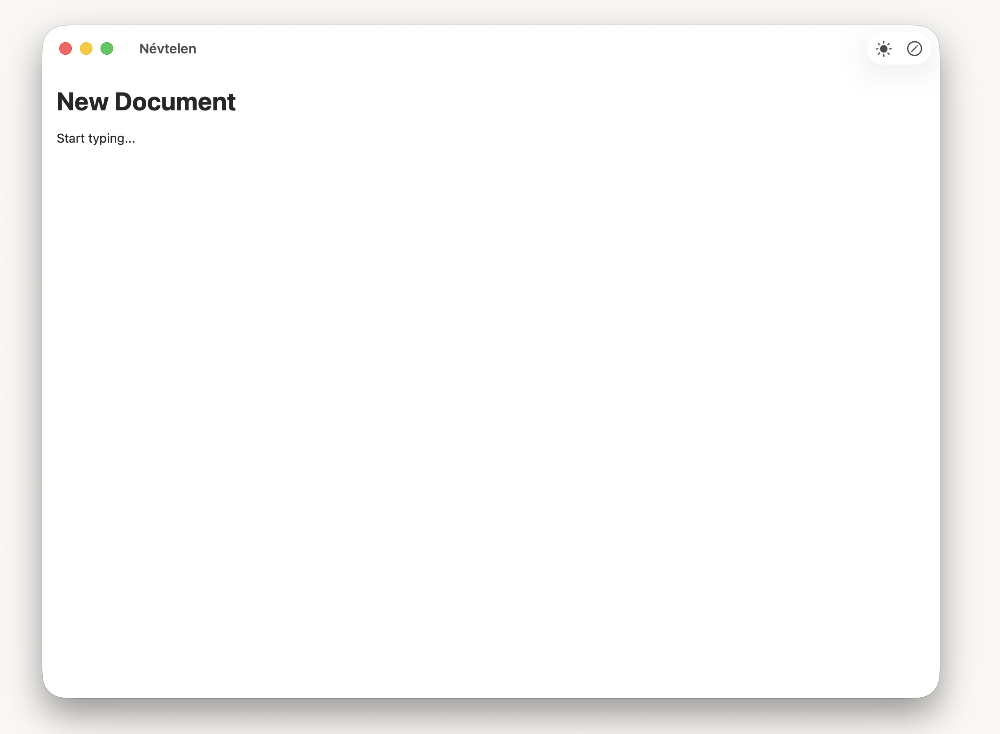
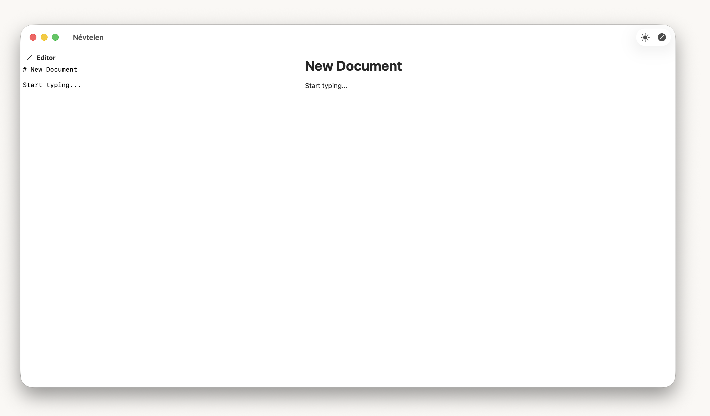

# MarkdownViewer — Native Markdown Editor & Previewer for macOS

A lightweight, fast, native macOS Markdown editor and viewer built with SwiftUI. Write and preview Markdown side by side with live rendering, dark mode support, and a clean minimal interface.

[](https://www.apple.com/macos/)
[](https://swift.org)
[](https://developer.apple.com/xcode/swiftui/)
[](LICENSE)

## Screenshots

| Preview Mode | Editor + Live Preview |
|:---:|:---:|
|  |  |

## Features

- **Live Preview** — Real-time Markdown rendering as you type
- **Split-View Editor** — Side-by-side Markdown source and rendered preview
- **Dark / Light Mode** — Toggle between dark and light themes, or follow system
- **Code Blocks** — Syntax-aware blocks with one-click copy to clipboard
- **Terminal Blocks** — Special green styling for bash/shell/zsh code blocks
- **Tables** — Full Markdown table support with column alignment and alternating row colors
- **Rich Markdown** — Headers, bold, italic, inline code, blockquotes, lists, horizontal rules
- **ASCII Art** — Preserves box-drawing characters and monospaced alignment
- **Document-Based** — Open, edit, and save `.md`, `.markdown`, and `.txt` files
- **Multi-Document** — Work with multiple files at the same time
- **Native macOS** — Built with SwiftUI for a fast, lightweight, native experience

## Installation

### Download

Download the latest `.app` from [Releases](https://github.com/feherk/MarkdownViewer/releases).

### Build from Source

```bash
git clone https://github.com/feherk/MarkdownViewer.git
cd MarkdownViewer
open MarkdownViewer.xcodeproj
```

Build and run with **⌘R** in Xcode.

## Usage

| Action | How |
|--------|-----|
| Open a file | **File → Open** (⌘O) or drag & drop |
| Toggle editor | Click the pencil icon in the toolbar |
| Switch theme | Click the sun/moon icon in the toolbar |
| Copy code block | Click the copy icon on any code block |

## Supported Markdown Syntax

- **Headings** — H1 through H4
- **Bold** (`**text**`) and **Italic** (`*text*`)
- **Inline code** with background highlight
- **Fenced code blocks** with language detection
- **Blockquotes**
- **Unordered and ordered lists** (including indented/nested)
- **Tables** with alignment (left, center, right)
- **Horizontal rules** (`---`, `***`, `___`)
- **ASCII art** and box-drawing characters

## Requirements

- macOS 13.0 (Ventura) or later
- Xcode 15+ (for building from source)

## License

MIT License — see [LICENSE](LICENSE) for details.

## Author

**Károly Fehér** — Concept, design, and project direction

Built with [Claude](https://claude.ai) (Anthropic) — AI pair programming
